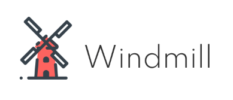

# Windmill

[](https://travis-ci.com/wixplosives/windmill)



**Windmill** is a set of tools to automate and improve testing components. Each tool runs on simulations, a file that describes a component in a specific configuation of props and state (the specific type is described [here](https://github.com/wixplosives/wcs-core/blob/d91a792a52b916fb6dc55b7a4f7c49715a010168/src/types.ts#L40), in `@wixc3/wcs-core`.

The basic usage looks like this:

```shell
windmill-[tool name]
```

Windmill will then find all simulation files (files ending with `.sim.ts` or `sim.tsx` by default) and run tests on them. There are also a few common CLI parameters:

-   `files` - simulation files matching glob (default: `*.sim.ts` or `*.sim.tsx`)
-   `debug` - true/false (default: false)
-   `project` - the path to the project (defaults to process.cwd())
-   `webpack` - the path to the webpack config of the project (defaults to process.cwd())

It's also possible to provide a list of simulation files, rather than having windmill run over everything. This is simply a list of files written after the command.

```shell
windmill-a11y my-cool-sim.sim.tsx my-other-cool-sim.sim.tsx
```

## Available Tools

-   `sanity` - component sanity test suite, asserts that:
    -   the component can render to string (for SSR compatibility)
    -   hydration in the client works as intended
    -   the component has no errors in <React.StrictMode />
    -   nothing was printed to the console
    -   events were removed after component unmounts
-   `a11y` - accessibility test:
    -   checks component render result for accessibility using axe-core

## windmill-a11y

Asserts that simulations are compatable with axe-core. Allows for varying levels of error impact (one of `minor`, `moderate`, `serious`, or `critical`). Specifying a level of impact specifies _that_ level and _above_ (so specifying `moderate` would target `moderate`, `serious`, and `critical`).

#### Usage

First install the package

```shell
yarn add --dev @wixc3/windmill-a11y
```

Make sure that the various peer-dependencies are met.

Then run the following command:

```shell
windmill-a11y
```

Impact can be specfied like so:

```shell
windmill-a11y --impact minor
```

`windmill-a11y` also exposes a programmatic API which lets you check whether or not a simulation is accessible. It's intended for use in your existing tests (if you'd rather not build your project twice). This programmatic API depends on your tests running in the browser.

It can be used like so:

```ts
import { expect } from 'chai';
import regularButtonSimulation from '../_wcs/simulations/Button/regular-button.sim';
import linkButtonSimulation from '../_wcs/simulations/Button/link-button.sim';
import { checkIfSimulationIsAccessible } from '@wixc3/windmill-a11y';

describe('Button simulation a11y checks', () => {
    it('regular button is a11y compatible', async () => {
        const results = await checkIfSimulationIsAccessible(regularButtonSimulation);
        expect(results.violations.length, `The violations were: ${results.violations}`).to.equal(0);
    });

    it('link button is a11y', async () => {
        const results = await checkIfSimulationIsAccessible(linkButtonSimulation);
        expect(results.violations.length, `The violations were: ${results.violations}`).to.equal(0);
    });
});
```

<a href="https://icons8.com/icon/122728/windmill">_Windmill icon by Icons8_</a>
